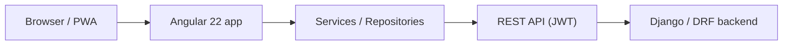

# Auto Repair Shop Web

## Overview

Cliente web PWA para la plataforma SaaS **Auto Repair Shop**.

Es el consumidor first-party de la API Django REST Framework del mismo producto. Juntos, front + API forman una solución full-stack multi-tenant para talleres mecánicos (autenticación JWT, roles, órdenes de trabajo, presupuestos, recibos y dashboard).

Companion API: [auto-repair-shop-api](https://github.com/jlrodriguezalvarado/auto-repair-shop-api)

## Features

- Authentication (JWT + refresh)
- Multi-company administration (`SUPER_ADMIN`)
- Customers
- Vehicles
- Services (catalog)
- Work Orders
- Quotes (estimates)
- Receipts
- Payments
- Dashboard
- Web Push (when VAPID is configured)
- Role-aware UI

## Architecture

```text
src/app/
  core/       Cross-cutting: API client, JWT interceptor, auth, i18n, push, models
  features/   Routed feature pages (login, shell, dashboard, customers, …)
  shared/     Reusable UI (loading/empty/error, toasts, confirm, menus)
```



## API Integration

- Base URL from `src/environments/environment*.ts` (`apiUrl`).
- Transport uses DRF **snake_case**; `ApiService` + `case-mapper` convert to/from Angular **camelCase** domain models.
- Monetary/decimal values stay as API strings until deliberate arithmetic when needed.
- Feature repositories own endpoint calls; `core/api` owns HTTP, auth headers, and mapping.

## Tech Stack

- Angular 22
- TypeScript
- RxJS
- Tailwind CSS 3
- PWA (`@angular/service-worker`)
- REST
- JWT (SimpleJWT compatible)
- Docker + Nginx (production image)

## Development

Requires Node.js matching Angular 22 (`engines.node` / `.nvmrc`: `^22.22.3 || ^24.15.0 || >=26.0.0`).

```bash
npm ci
npm start
```

App: `http://localhost:4300` → API default `http://localhost:8001/api` (`environment.ts`).

Optional UI-only mode: set `useMockApi: true` in `environment.ts`.

```bash
npm run lint
npm run format:check
npm test
npm run build:prod
```

For production builds, copy and edit:

```bash
cp src/environments/environment.production.example.ts src/environments/environment.production.ts
```

`environment.production.ts` is gitignored (host-specific URLs stay local).

## Testing

- Unit tests: Karma + Jasmine (`npm test`, ChromeHeadless CI launcher).
- Focus areas: case mapper, JWT refresh, role guards, work-order totals normalization.
- CI runs lint, tests, and production build on PRs to `develop` / `main`.

## Production

- Build: `npm ci && npm run build:prod`
- Image: Nginx serves `dist/app-taller-mecanico/browser` with SPA fallback (`deploy/nginx-spa.conf`).
- Details: [DEPLOY.md](DEPLOY.md). Compose / Traefik stack lives in the API repo.

## Backend

This web app is incomplete without the API. See:

**[auto-repair-shop-api](https://github.com/jlrodriguezalvarado/auto-repair-shop-api)**

The API README links back here — one product, two repositories.

## Screenshots

Place real captures under [`docs/images/`](docs/images/). Recommended set:

| File                 | Screen              |
| -------------------- | ------------------- |
| `login.png`          | Login               |
| `dashboard.png`      | Dashboard           |
| `customers.png`      | Customers list      |
| `vehicle-detail.png` | Vehicle detail      |
| `work-order.png`     | Work order          |
| `quote.png`          | Estimate / quote    |
| `receipt.png`        | Receipt / payment   |
| `mobile.png`         | Responsive / mobile |

Do not commit fabricated screenshots.

## License

MIT — see [LICENSE](LICENSE).

## Security

See [SECURITY.md](SECURITY.md).
